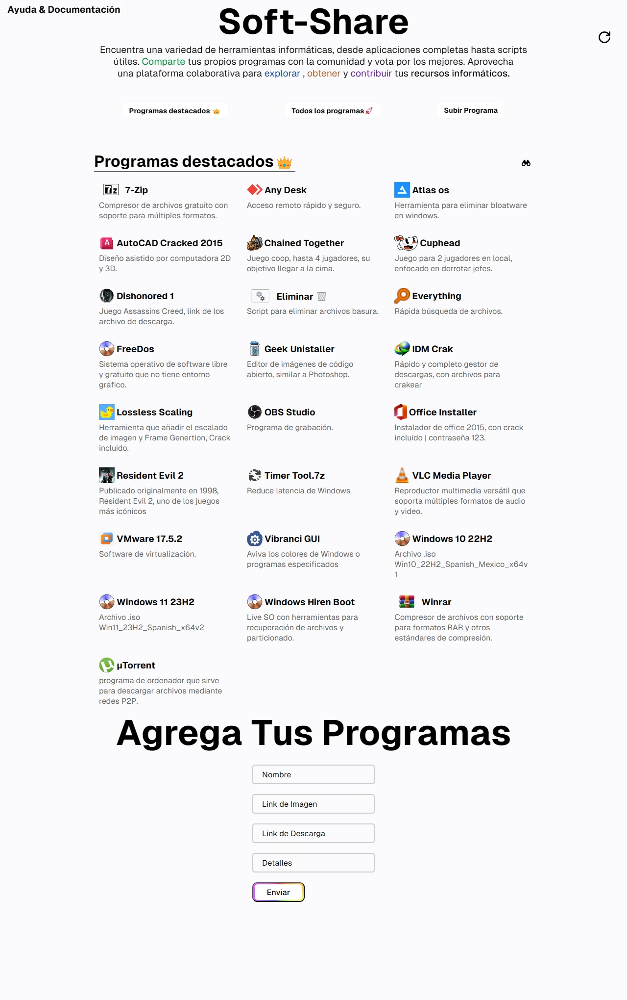

<h1 align="center">Bon Día👋</h1>

- 🔭 Actualmente estoy trabajando y refinando 
  <a href="https://soft-share.vercel.app/" style="color: red;">Soft-Share</a>

Mini proyecto para guardar y subir los recursos que uso, ya sean instaladores, ejecutables o juegos. Tu también puedes subir lo que quieras!

<h3 style="display: flex; ">Mi gusto de canales de youtube </h3>
<ul">
  <li style="display: flex; align-items: center;">
    <a href="https://www.youtube.com/@HRom">Hrom</a>
    
  </li>
  <li style="display: flex; align-items: center;">
    <a href="https://www.youtube.com/@DalasReview">Dalas Review</a>
    
  </li>
  <li style="display: flex; align-items: center;">
    <a href="https://www.youtube.com/@CienciaDeSofa">Ciencia de Sofá</a>
    
  </li>
  <li style="display: flex; align-items: center;">
    <a href="https://www.youtube.com/@Platonto">Platonto</a>
    
  </li>

  <li style="display: flex; align-items: center;">
    <a href="https://www.youtube.com/@kurzgesagt_es">En Pocas Palabras</a>
    
  </li>
</ul>
